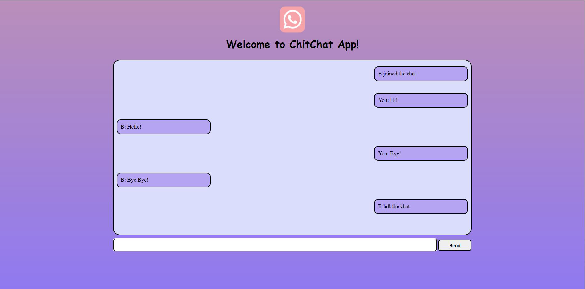
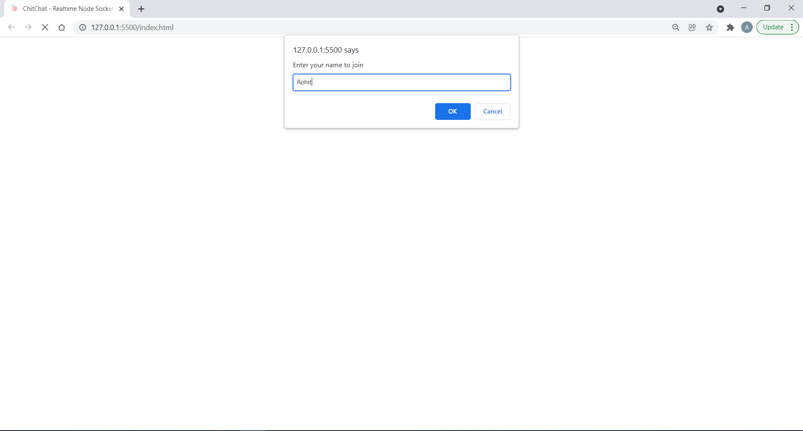
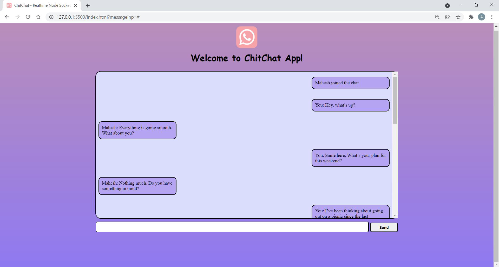

# RealTime Chat Application - ChitChat

## Node.js based Web Application ##

* It is a scalable Realtime Chatting Application using Node.js and Socket.io that provides an interface for multiple user chatting at the same time.

### Technologies Used ###
* __FrontEnd Technologies__- HTML, CSS
* __BackEnd Technologies__- JavaScript, Node.js
* __Socket.io__ module for a two-way connection between client and server.

### Features ###
* Everytime a new user tries to join, ask for his/her name.
* If a new user joins, let the other users connected to the server know.
* If someone sends the message, broadcast it to other people.
* Plays a sound as notification, everytime a message is received.
* If someone leaves the chat, let others know.

### Process to run the app ###

#### Prerequisites ####
* __Node.js__ should be installed on your local machine.
* __Live Server Extension__ for VS Code should be installed. (Extension ID - ritwickdey.liveserver)

#### Steps ####
* Clone the repositry
* Run nodemon __nodeServer/indes.js__
* Navigate to __index.html__ and open it.
* Right click anywhere in the file __index.html__ and from the menu that appears select __'Open with Live server'__.
* An instance of the application will appear in the browser.

